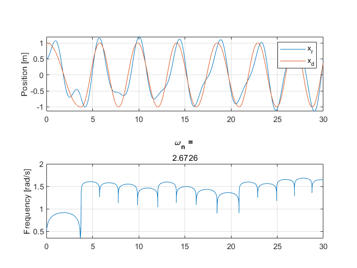
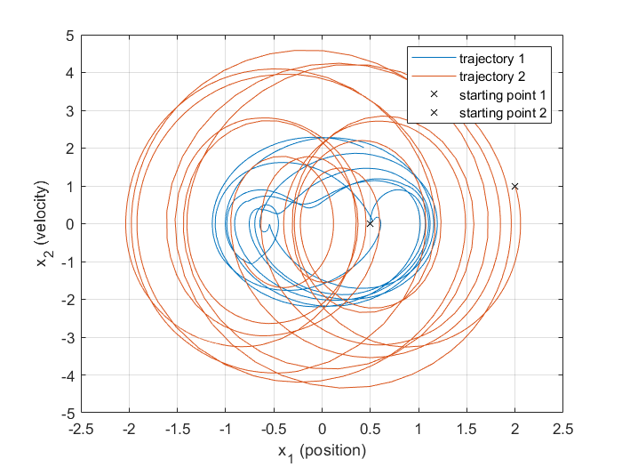

# LEXO-ANO
control and simulation for an exo-skeleton LEXO from STARX @ U-M  
This is a simple demo of our control and parameters are not tuned yet.
## Instruction
Run `ANO_sim\Ano_sim.m` to see state space simulation of the Adaptive Natural Oscillator.
## Results
Position tracking and frequency convergence under Gaussian disturbance.
### Tracking a sine wave with converging frequency

### State-space plot of two trajectories with random initial position

### TODO:
visualize the oscillator in a two-link robot.
## Reference
1. The built-in simulator of this project is developed by [jakub-kaminski](https://github.com/jakub-kaminski/2link-robot)
2. The [Adaptive Natural Oscillator](https://www.sciencedirect.com/science/article/pii/S0921889016307485).
3. Theoretical analysis of the [Adaptive Frequency Oscillator](https://www.sciencedirect.com/science/article/pii/S0167278906000819).
